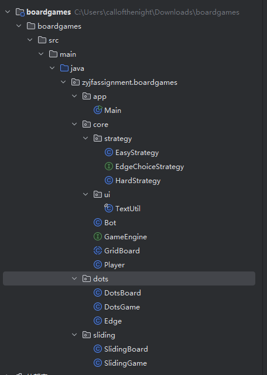
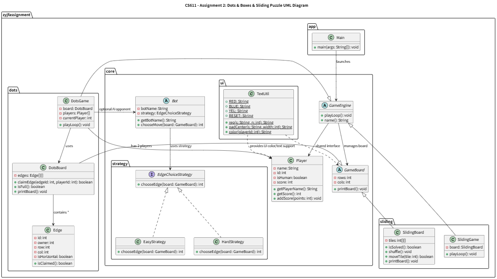

# CS611-Assignment 2
## Dots & Boxes Game (N-Puzzle)

---------------------------------------------------------------------------
- **Name**: [Jingfeng Li]&
            [Ziyang Wang]
- **Email**: [ljf628@bu.edu]&[zywang1@bu.edu]
- **Student ID**: [U73840242]&[U12285471]

## Files
---------------------------------------------------------------------------
### `app/`
- **`Main.java`** — Game starting entry.

---

### `core/`

####  Game Base & Player Logic
- **`GameEngine.java`** — Common interface defining the `playLoop()` method for all games.  
- **`GameBoard.java`** — Abstract base for grid-based boards; provides dimensions and rendering methods.  
- **`Player.java`** — Defines player attributes including name, id, and type (human or Bot).  
- **`Bot.java`** — Abstract Bot class; uses strategy pattern for varying difficulty levels.  

####  `core/strategy/`
- **`EdgeChoiceStrategy.java`** — Strategy interface for edge selection palying logic used by bots.  
- **`EasyStrategy.java`** — Random move selection; represents the **EasyBot** behavior.  
- **`HardStrategy.java`** — Based on designing an algorithm that allowing bot can select A more profitable approach.

#### `core/ui/`
- **`TextUtil.java`** — Text rendering and beautification of terminal display
---

### `dots/`
- **`DotsGame.java`** — Implementing the game logic for **Dots & Boxes**.
- **`DotsBoard.java`** — Representing the dot grid and tracks claimed edges and completed boxes.  
- **`Edge.java`** — Representing an edge connecting two dots and recording ownership and position.

---
### `sliding/`
- **`SlidingGame.java`** — Game loop for **Sliding Puzzle**.
- **`SlidingBoard.java`** — Implementing the NxN tile board, supporting shuffling, movement, and completion checks.

---
## File Structure and UML
---------------------------------------------------------------------------
---
### `File Structure `


---
### `UML`


## Notes
---------------------------------------------------------------------------
- This project demonstrates modular object-oriented design using **inheritance**, **composition**, and the **strategy pattern**.  
- Both games share a unified interface (`GameEngine`), showing **polymorphism** across different board types.  
- **EasyBot** and **HardBot** are implemented through interchangeable strategies to adjust difficulty dynamically.  
- **TextUtil** ensures clear terminal display with colorful codes output.

---

## How to compile and run
---------------------------------------------------------------------------
1. Openning the terminal
2. Running the following instructions:
   - cd ......(the path of files) (Enter the directory the code is stored);
   - javac -d out @((Get-ChildItem -Recurse -Filter *.java .\src\main\java).FullName) (Compiling all java files);
   - java -cp out zyjfassignment.boardgames.app.Main(Executing java programme).
## Input/Output Example
---------------------------------------------------------------------------

```text
java -cp out zyjfassignment.boardgames.app.Main 
Choose a game: 1) Dots & Boxes  2) Sliding Puzzle
1
Rows and columns (e.g., 7 7, default 7 7): 3 3
Mode: 1) Human vs Human  2) Human vs AI (Easy)  3) Human vs AI (Hard)
2

 ?  0   ?  1   ?
6      7      8
 ?  2   ?  3   ?
9      10     11
 ?  4   ?  5   ?
Score  Player1: 0   AI: 0
Player1 choose an edge id (q to quit): 1

 ?  0   ?───── ?
6      7      8
 ?  2   ?  3   ?
9      10     11
 ?  4   ?  5   ?
Score  Player1: 0   AI: 0
AI choose an edge id (q to quit): 2

 ?  0   ?───── ?
6      7      8
 ?───── ?  3   ?
9      10     11
 ?  4   ?  5   ?
Score  Player1: 0   AI: 0
Player1 choose an edge id (q to quit): 2
Illegal or already-claimed edge.

 ?  0   ?───── ?
6      7      8
 ?───── ?  3   ?
9      10     11
 ?  4   ?  5   ?
Score  Player1: 0   AI: 0
Player1 choose an edge id (q to quit): 0

 ?───── ?───── ?
6      7      8
 ?───── ?  3   ?
9      10     11
 ?  4   ?  5   ?
Score  Player1: 0   AI: 0
AI choose an edge id (q to quit): 7

 ?───── ?───── ?
6       ║      8
 ?───── ?  3   ?
9      10     11
 ?  4   ?  5   ?
Score  Player1: 0   AI: 0
Player1 choose an edge id (q to quit): 3

 ?───── ?───── ?
6       ║      8
 ?───── ?───── ?
9      10     11
 ?  4   ?  5   ?
Score  Player1: 0   AI: 0
AI choose an edge id (q to quit): 8

 ?───── ?───── ?
6       ║   ●   ║
 ?───── ?───── ?
9      10     11
 ?  4   ?  5   ?
Score  Player1: 0   AI: 1
AI choose an edge id (q to quit): 6

 ?───── ?───── ?
 ║   ●   ║   ●   ║
 ?───── ?───── ?
9      10     11
 ?  4   ?  5   ?
Score  Player1: 0   AI: 2
AI choose an edge id (q to quit): 4

 ?───── ?───── ?
 ║   ●   ║   ●   ║
 ?───── ?───── ?
9      10     11
 ?───── ?  5   ?
Score  Player1: 0   AI: 2
Player1 choose an edge id (q to quit): 5

 ?───── ?───── ?
 ║   ●   ║   ●   ║
 ?───── ?───── ?
9      10     11
 ?───── ?───── ?
Score  Player1: 0   AI: 2
AI choose an edge id (q to quit): 10

 ?───── ?───── ?
 ║   ●   ║   ●   ║
 ?───── ?───── ?
9       ║      11
 ?───── ?───── ?
Score  Player1: 0   AI: 2
Player1 choose an edge id (q to quit): 9

 ?───── ?───── ?
 ║   ●   ║   ●   ║
 ?───── ?───── ?
 ┃   ●   ║      11
 ?───── ?───── ?
Score  Player1: 1   AI: 2
Player1 choose an edge id (q to quit): 11

 ?───── ?───── ?
 ║   ●   ║   ●   ║
 ?───── ?───── ?
 ┃   ●   ║   ●   ┃
 ?───── ?───── ?
Score  Player1: 2   AI: 2
Game over.
Draw!
